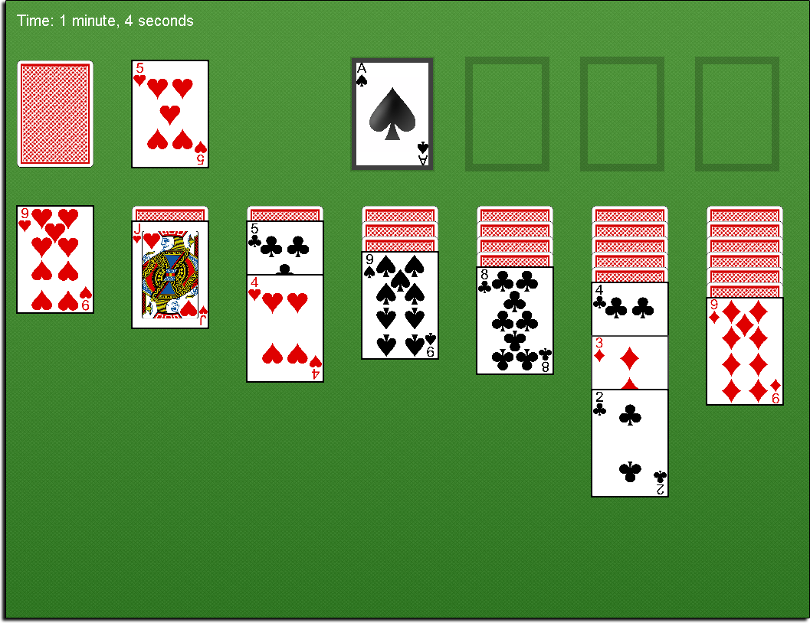

# Solitaire

A Java implementation of the classic Solitaire game  
This project was developed in 2014 

### Requirements
- JRE 1.8+ (Running only)
- JDK 1.8+ (Running & Compiling)

### Installation
[Download](https://github.com/kyleruss/solitaire/releases/latest) the latest release  
Unzip the contents into an appropriate directory  
Run `Solitaire.exe` to launch

### License
This project is available under the MIT License  
See [LICENSE](LICENSE) for more details
